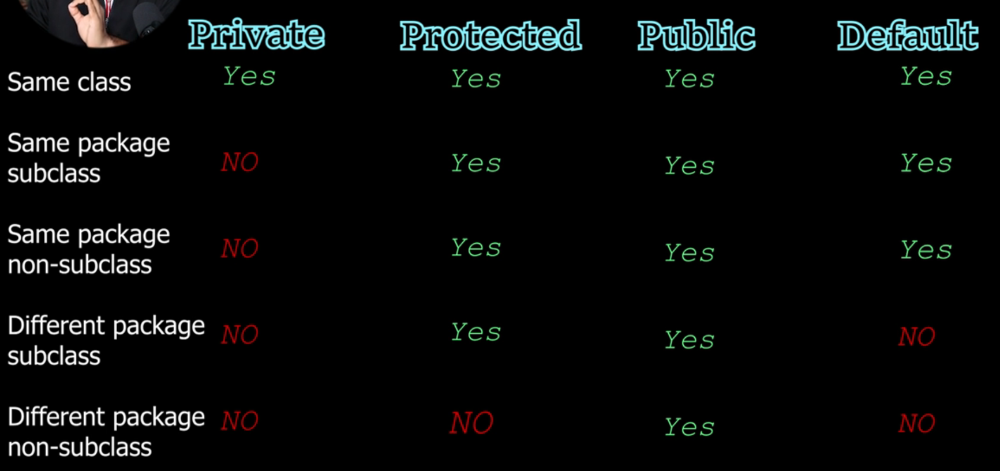

# Java Practice

## Keeping `.class` Files Separate

To keep compiled `.class` files separate from your source code, use the `-d` option with `javac` to specify a destination directory (e.g., `bin` or `out`).

### 1. Create an output directory
```bash
mkdir -p bin
```

### 2. Compile Java files into the output directory
```bash
javac -d bin path/to/File.java
```

### 3. Run the compiled class
```bash
java -cp bin ClassName
```
*(If the file is inside a subfolder/package, use `java -cp bin folder.ClassName`)*

### 4. Clean up compiled files
```bash
rm -rf bin
```

## Code Runner Setup (VSCodium)

This project has no `src/` folder and files use the default package (no `package` line).
So compile any nested file into root `bin/` and run by **class name only**.

`.vscode/settings.json`:
```json
{
    "code-runner.runInTerminal": true,
    "code-runner.saveFileBeforeRun": true,
    "code-runner.executorMap": {
        "java": "cd $workspaceRoot && mkdir -p bin && javac -d bin --source-path \"$workspaceRoot\" \"$fullFileName\" && java -cp bin \"$fileNameWithoutExt\""
    }
}
```

How it works for any nested file (e.g. `JDBC/Main.java`):
- `cd $workspaceRoot` -> `bin/` always resolves to project root.
- `mkdir -p bin` -> creates `bin/` if deleted.
- `javac -d bin ... "$fullFileName"` -> `.class` goes to `bin/`, source dir stays clean.
- `java -cp bin "$fileNameWithoutExt"` -> runs `Main`, not a file path.

### Why the old config failed

Old command:
```
javac -d bin --source-path src $fullFileName && java -cp bin $dirWithoutTrailingSlash/$fileNameWithoutExt
```

1. `--source-path src` -> there is no `src/` directory here, sources live directly under `practice/`. Use `"$workspaceRoot"`.
2. `java -cp bin $dirWithoutTrailingSlash/$fileNameWithoutExt` expands to:
   ```
   java -cp bin "/home/.../practice/JDBC"/Main
   ```
   `java` expects a class name (`Main`), not a path. Slashes get treated as package separators, hence:
   `Could not find or load main class .home.suman...` + `ClassNotFoundException`.

### Note: duplicate class names

`Basics/Main.java`, `JDBC/Main.java`, `Problem/Main.java` are all `class Main` in the default package, so they all compile to `bin/Main.class` and overwrite each other. This is fine since Code Runner recompiles before every run, but don't rely on stale files in `bin/`.

